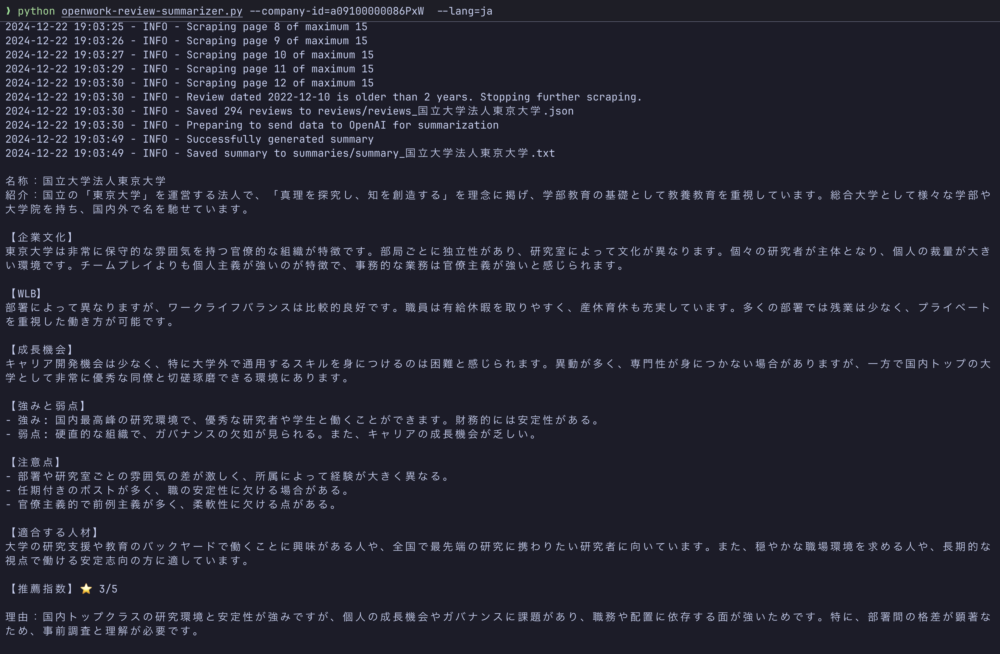

# OpenWork Review Summarizer

> [!NOTE]
> English and Chinese versions are available in the [README_EN.md](README_EN.md) and [README_ZH.md](README_ZH.md).
> Contributions are welcome, and check the [CONTRIBUTING.md](CONTRIBUTING.md) for more information.

本ツールは、就活者が企業分析やスカウト判断を迅速に行えるように支援するためのものです。  
具体的には、OpenWork の情報を用いて最近2年分の企業評価を自動で取得し、大規模言語モデル（LLM）を使ってこれらの評価を分析・要約します。

## 準備
- 有効かつフルレビューにアクセス可能な [OpenWork](https://www.openwork.jp/) アカウント  
- 有効な [OpenAI](https://platform.openai.com/) APIキー

## インストール
1. プロジェクトをクローン
   ```bash
   git clone https://github.com/ming-hao-xu/openwork-review-summarizer.git
   cd openwork-review-summarizer
   ```

2.	(オプション) 仮想環境を作成・有効化

    Linux / Mac
    ```bash
    python -m venv venv
    source venv/bin/activate
    ```

    Windows
    ```bash
    python -m venv venv
    .\venv\Scripts\activate
    ```

3. 依存関係をインストール

    ```bash
    pip install -r requirements.txt
    ```

4. `.env` ファイルを作成・設定

    ```
    OPENAI_API_KEY=あなたのopenai_api_key
    OPENAI_PROJECT_ID=オプション
    OPENWORK_USERNAME=あなたのopenworkユーザー名
    OPENWORK_PASSWORD=あなたのopenworkパスワード
    ```

> [!TIP]
> `.env` に設定する情報はリポジトリに含めないようにし、公開リポジトリへのプッシュは避けてください。

## 実行方法（一回あたり6.5円程度の費用がかかります）

```bash
python openwork-review-summarizer.py --company-id=a09100000086PxW  --lang=ja
```

- `--company-id` には、OpenWorkのURLに含まれる `m_id` を指定します。
  例えば、`https://www.openwork.jp/companies/a09100000086PxW` の場合、`a09100000086PxW` が `--company-id` になります。

- `--lang` には、出力言語として ja(日本語) / en(英語) / zh(中国語) を指定できます。

スクリプトの出力:  
- JSON形式のレビューが `reviews/` ディレクトリに保存されます  
- 要約されたテキストが `summaries/` ディレクトリに保存されます  
- 結果がコンソールにも表示されます  



## カスタマイズ

`summarize_reviews()` 関数を編集することで、要約のスタイルや重点の置き方を自由に変更できます。

## 免責事項
- 情報源：本ツールは、ユーザー自身が正規にアクセスできるOpenWork上のレビューを取得し、要約を行います。
- 判断責任：本ツールの出力はあくまで参考情報であり、利用者の最終的な判断は自己責任で行ってください。
- データ安全：本ツールは、取得したレビューやユーザーの認証情報を外部へ投稿・転送しません。ただし、`.env` ファイルの管理には注意し、公の場所へのアップロードは避けてください。
- 関係性：OpenWorkおよびOpenAIとは本ツールは無関係であり、非公式の個人開発ツールです。
