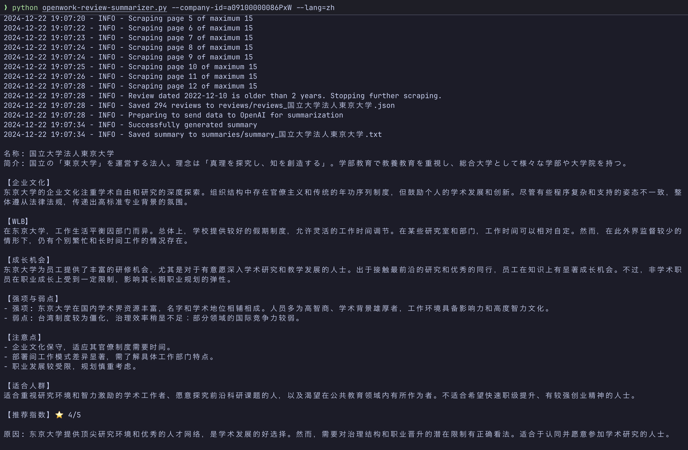

# OpenWork Review Summarizer

> [!NOTE]
> 该项目正在开发中，可能存在bug。请报告任何问题。

该工具可帮助求职者尤其是崩溃的留学生快速完成企业分析和筛选决策。  
它会使用你的 OpenWork 账号来获取最近2年的企业评价数据，并通过大型语言模型（LLM）进行自动分析和总结。

## 环境要求
- 有效且可访问完整评价的 [OpenWork](https://www.openwork.jp/) 账号  
- 有效的 [OpenAI](https://platform.openai.com/) API Key  

## 安装步骤
1. 克隆本项目
   ```bash
   git clone https://github.com/ming-hao-xu/openwork-review-summarizer.git
   cd openwork-review-summarizer
   ```

2. （可选）创建并激活虚拟环境

   Linux / Mac
   ```bash
   python -m venv venv
   source venv/bin/activate
   ```

   Windows
   ```bash
   python -m venv venv
   .\venv\Scripts\activate
   ```

3. 安装依赖
   ```bash
   pip install -r requirements.txt
   ```

4. 配置 `.env` 文件

   ```
   OPENAI_API_KEY=你的openai_api_key
   OPENAI_PROJECT_ID=可选
   OPENWORK_USERNAME=你的openwork用户名
   OPENWORK_PASSWORD=你的openwork密码
   ```

> [!TIP]
> 请勿将 `.env` 文件上传到公共代码仓库，保护你的账号信息安全。

## 使用方法 (每次运行约6.5日元)

```bash
python openwork-review-summarizer.py --company-id=a09100000086PxW --lang=zh
```

- `--company-id`: 提取 OpenWork URL 中的 `m_id` 值。例如：  
  `https://www.openwork.jp/companies/a09100000086PxW` 中的 `m_id` 为 `a09100000086PxW`。

- `--lang`: 指定输出语言为 `ja`（日语）、`en`（英语）或 `zh`（中文）。

运行后工具会输出：  
- 保存于 `reviews/` 目录下的 JSON 格式评论  
- 保存于 `summaries/` 目录下的总结文本  
- 同时在终端显示结果  



### 自定义

可修改 `main.py` 中的 `summarize_reviews()` 函数，调整总结的风格、重点或格式。

## 免责声明
- **信息来源**：该工具仅抓取和总结你有权限查看的 OpenWork 评论。  
- **决策责任**：工具输出内容仅供参考，最终决策由用户自行承担责任。  
- **数据安全**：工具不会将评论或账号信息传输至外部，但请妥善保管 `.env` 文件。  
- **非官方性质**：该工具与 OpenWork 和 OpenAI 无任何官方合作关系，属于个人开发项目。
